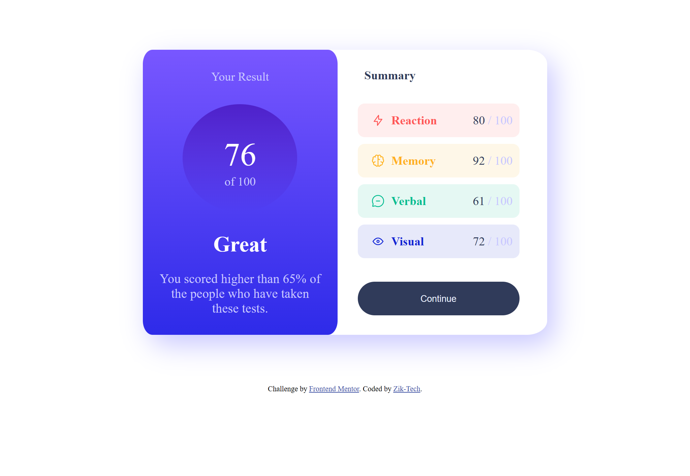

# Frontend Mentor - Results summary component solution

This is a solution to the [Results summary component challenge on Frontend Mentor](https://www.frontendmentor.io/challenges/results-summary-component-CE_K6s0maV). Frontend Mentor challenges help you improve your coding skills by building realistic projects. 

## Table of contents

- [Overview](#overview)
  - [The challenge](#the-challenge)
  - [Screenshot](#screenshot)
  - [Links](#links)
- [My process](#my-process)
  - [Built with](#built-with)
  - [What I learned](#what-i-learned)
- [Author](#author)


## Overview

### The challenge

Users should be able to:

- View the optimal layout for the interface depending on their device's screen size
- See hover and focus states for all interactive elements on the page

### Screenshot



### Links

- Solution URL: [solution URL](https://github.com/Zik-Tech/Results-summary-component)
- Live Site URL: [live site URL](https://zik-tech.github.io/Results-summary-component/)

## My process

### Built with

- Semantic HTML5 markup
- CSS custom properties
- Flexbox
- CSS Grid
- Mobile-first workflow

### What I learned

```css
.first-part {
    padding: 30px 20px 50px 20px;
    max-width: 18.5rem;
    display: flex;
    background-image: linear-gradient(hsl(252, 100%, 67%), hsl(241, 81%, 54%));
    border-radius: 5%;
    height: auto;
    flex-basis: 16rem;
    display: inline;
}

@media only screen and (max-width: 550px){
    .continue {
        width: 200px;
    }
}
```

### Useful resources

- [Css3 Mediaqueries](https://www.w3schools.com/css/css3_mediaqueries.asp) - This helped me for Media queries in css. I really liked this pattern and will use it going forward.
- [Css3 Linear Gradient](https://www.example.com) - This is an amazing article which helped me finally understand XYZ. I'd recommend it to anyone still learning this concept.


## Author

- Website - [Zik-Tech](https://github.com/Zik-Tech)
- Frontend Mentor - [Zik-Tech](https://www.frontendmentor.io/profile/Zik-Tech)
- Twitter - [ZikTech1](https://twitter.com/ZikTech1)
